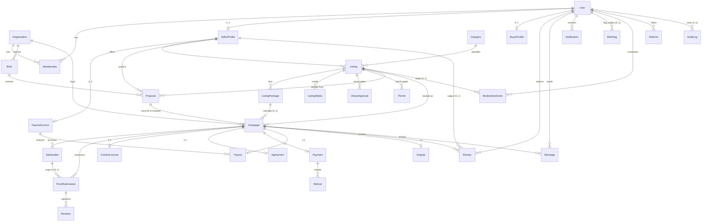

# 15 · Data Model

The single source of truth is `/app/prisma/schema.prisma` (applied in migration
`20260828011916_init`). This document explains it; if they ever disagree, the schema wins
and this file must be fixed. Conventions: ids are `cuid()` strings; money is **integer
cents**; all state/role fields are strings on SQLite ("pseudo-enums") with values enforced
in code (see §4).

## 1. Entity-by-entity

### Identity & access

| Model | Purpose | Key fields | Important constraints |
|---|---|---|---|
| `User` | One human account | `email`, `passwordHash` (scrypt), `role` (BUYER\|SELLER\|ADMIN), `identityStatus` (UNVERIFIED\|PENDING\|VERIFIED), `isAtLeast18` | `email` unique; role is per-user, not per-membership |
| `Organization` | Buyer-side entity (brand or agency) | `name`, `kind` (BRAND\|AGENCY), `website` | Briefs and campaigns belong to orgs, not users |
| `Membership` | User↔org link | `role` (OWNER\|MEMBER) | `@@unique([userId, orgId])` — one membership per user per org |
| `BuyerProfile` | Buyer persona details | `brandName`, `industry`, `brandSafetyNotes` | `userId` unique (0..1 per user) |
| `SellerProfile` | Seller persona + track record | `displayName`, `city`, `reliabilityScore` (0–100), `completedCount`, `responseHours` | `userId` unique; owns listings, proposals, payout account |
| `PayoutAccount` | Where seller money goes | `provider` (default `mock_stripe_connect`), `externalId`, `status` (ONBOARDING\|ACTIVE\|RESTRICTED) | `sellerProfileId` unique — exactly one per seller |

### Supply

| Model | Purpose | Key fields | Important constraints |
|---|---|---|---|
| `Category` | Listing taxonomy | `slug`, `name` | `slug` unique |
| `Listing` | A sponsorable moment for sale | `title`, `slug`, `pitch`, `city`, `state` (D-015 machine), `basePriceCents`, `audienceEstimate`+`audienceEvidence` (D-020: evidence required if estimate present), `venueApprovalRequired`, `permitsRequired`, `sponsorRestrictions`, `cancellationPolicy` (STANDARD\|FLEXIBLE\|STRICT), `proofMethod`, `riskLevel` (LOW\|MEDIUM\|HIGH), `eventDate` | `slug` unique; belongs to seller + category |
| `ListingPackage` | Priced tier of a listing | `name`, `priceCents`, `deliverables` (newline-separated), `exclusivity` (NONE\|CATEGORY\|FULL), `usageRightsDays` (default 30) | Campaigns reference the package booked |
| `ListingMedia` | Listing images/videos | `kind` (IMAGE\|VIDEO), `url`, `alt` | URLs only in MVP (no upload infra) |
| `VenueApproval` | Per-venue approval tracking | `venueName`, `status` (REQUIRED\|REQUESTED\|APPROVED\|DENIED), `notes` | Many per listing; gates `APPROVAL_PENDING → IN_PROGRESS` |
| `Permit` | Permit tracking | `authority`, `kind`, `status` (REQUIRED\|FILED\|GRANTED\|DENIED), `notes` | Many per listing; same gating role |

### Demand

| Model | Purpose | Key fields | Important constraints |
|---|---|---|---|
| `Brief` | Buyer's request for proposals | `objective`, `audience`, `city`, `budgetCents`, `targetDate`, `restrictions`, `status` (SUBMITTED\|MATCHING\|PROPOSED\|CLOSED) | Belongs to an org |
| `Proposal` | Seller's pitch against a brief | `packageSummary`, `priceCents`, `status` (DRAFT\|SENT\|ACCEPTED\|DECLINED\|WITHDRAWN) | Links brief + listing + seller; at most one campaign springs from it |

### Campaign execution

| Model | Purpose | Key fields | Important constraints |
|---|---|---|---|
| `Campaign` | The unit of work and money | `state` (D-015 machine), `priceCents` (GMV basis), `buyerFeeCents`, `sellerPayoutCents`, `platformFeeCents` (all denormalized from `computeFees` at booking so history survives fee changes), `scheduledFor` | `proposalId` unique (a proposal converts to at most one campaign); org + listing + optional package |
| `Deliverable` | One promised item | `title`, `status` (PENDING\|SUBMITTED\|ACCEPTED\|REVISION), `sortOrder` | Proof maps to deliverables |
| `ProofSubmission` | Timestamped evidence | `url`, `caption`, `capturedAt` (when it happened) vs `submittedAt` (when uploaded), `status` (SUBMITTED\|ACCEPTED\|REVISION_REQUESTED) | Optional `deliverableId`; many per campaign |
| `Revision` | A rejection reason on a proof | `reason`, `status` (OPEN\|RESOLVED) | Child of proof — revision history is never overwritten |
| `ContentLicense` | Usage rights granted to buyer | `scope` (ORGANIC\|PAID_MEDIA), `durationDays` (default 30), `startsAt` | `campaignId` unique — one license per campaign |
| `Agreement` | Accepted campaign terms | `version`, `text`, `buyerAcceptedAt`, `sellerAcceptedAt` | `campaignId` unique; both timestamps needed for "fully executed" |

### Money

| Model | Purpose | Key fields | Important constraints |
|---|---|---|---|
| `Payment` | Buyer charge | `status` (REQUIRES_PAYMENT\|AUTHORIZED\|CAPTURED\|PARTIALLY_REFUNDED\|REFUNDED\|FAILED), `amountCents` (price + buyer fee), `buyerFeeCents`, `platformFeeCents`, `processingFeeCents`, `externalId` (provider ref) | `campaignId` unique — **one payment per campaign** |
| `Refund` | One refund action | `amountCents`, `reason` | Many per payment; sum ≤ `Payment.amountCents`, enforced in `refundCampaign` |
| `Payout` | Seller's money | `amountCents` (80% of price), `status` (HELD\|RELEASED\|PAID\|CANCELED), `releasedAt`, `paidAt` | `campaignId` unique — **one payout per campaign** |
| `Dispute` | Formal disagreement | `openedBy` (userId), `reason`, `status` (OPEN\|RESOLVED_REFUND\|RESOLVED_PARTIAL\|RESOLVED_RELEASE), `resolution`, `resolvedAt` | `campaignId` unique — **one dispute per campaign** |
| `WebhookEvent` | Provider event ledger | `id` = provider event id (**primary key**), `provider`, `kind`, `payload` (JSON string) | PK conflict = duplicate delivery = no-op (idempotency) |

### Community & comms

| Model | Purpose | Key fields | Important constraints |
|---|---|---|---|
| `Review` | Post-campaign rating | `rating`, `body`, optional `sellerProfileId` (subject) | `@@unique([campaignId, authorId])` — one review per author per campaign |
| `Message` | On-platform campaign thread | `body`, `senderId` | Scoped to a campaign; retained for disputes |
| `Notification` | In-app inbox | `kind`, `body`, `href`, `readAt` | Written by `notify()` on every state change |

### Trust, safety, growth, telemetry

| Model | Purpose | Key fields | Important constraints |
|---|---|---|---|
| `RiskFlag` | Fraud/T&S review item | `entityType` (LISTING\|CAMPAIGN\|USER) + `entityId`, `severity` (LOW\|MEDIUM\|HIGH), `status` (OPEN\|CLEARED\|ACTIONED) | Polymorphic by convention (no FK to target) |
| `ModerationAction` | What a moderator did | `action` (APPROVE\|REJECT\|REQUEST_CHANGES\|PAUSE\|BAN), `notes` | Always attributed (`moderatorId`); optional listing link |
| `Referral` | Referral credit | `code` unique, `creditCents` (default 25000), `status` (ISSUED\|REDEEMED\|CREDITED) | `redeemedById` is a plain string (no FK) |
| `PromoCode` | Discount codes | `code` unique, `percentOff`, `maxUses`/`usedCount`, `expiresAt` | Standalone |
| `AnalyticsEvent` | First-party event stream | `name`, optional `userId`, `props` (JSON string) | Written by `track()`; taxonomy in doc 16 |
| `AuditLog` | Immutable who-did-what | `actorId` (nullable = system), `action`, `entityType`+`entityId`, `detail` | Append-only by convention; every state transition writes one |

## 2. ER diagram (core entities)

(`WebhookEvent`, `PromoCode`, `AnalyticsEvent` are standalone tables with no FK
relations by design — the first is keyed by provider event id, the latter two are
append-only telemetry/config.)

## 3. Constraints that carry business meaning

- **`Campaign.proposalId` unique** — a proposal converts into at most one campaign;
  double-booking a proposal is structurally impossible.
- **One `Payment`, one `Payout`, one `Dispute` per campaign** (`campaignId` unique on all
  three) — the money story per campaign is single-threaded: one charge (with a `Refund`
  child table for partials), one payout, one formal dispute. This makes reconciliation and
  the dispute procedure (doc 13 §11) unambiguous. Multi-charge or split-payout designs
  would be a schema change, deliberately.
- **`@@unique([campaignId, authorId])` on `Review`** — each party reviews a campaign
  once; no review-bombing a counterparty through one transaction.
- **`WebhookEvent.id` as primary key** — the provider's event id *is* the key, so replayed
  webhook deliveries and retried idempotency keys collide at the DB and become no-ops.
  This is the entire idempotency mechanism (doc 14 §5) — no separate dedupe table.
- **`@@unique([userId, orgId])` on `Membership`** — no duplicate memberships.
- **Unique `email`, `slug`s, `Referral.code`, `PromoCode.code`** — natural keys for lookup.

## 4. Why money is integer cents; why states are strings

**Integer cents:** floating-point money drifts (0.1 + 0.2 ≠ 0.3) and SQLite has no
`DECIMAL`. Every amount field is an `Int` of cents; `computeFees()` does integer math with
explicit `Math.round` at the two percentage points, and `formatCents()` renders. The fee
fields on `Campaign`/`Payment` are **denormalized copies at booking time** so historical
records are immune to future changes in `fees.ts` constants.

**String pseudo-enums:** Prisma does not support `enum` on SQLite (D-012). So allowed
values live in code, enforced at three layers:

1. `src/lib/state-machines.ts` — the canonical value lists (`LISTING_STATES`,
   `CAMPAIGN_STATES`) *and* the only legal transitions between them, role-gated;
   `assertListingTransition`/`assertCampaignTransition` throw 409 `TransitionError`.
2. `src/lib/campaigns.ts` (`transitionCampaign`) — the single write path for campaign
   state, which also audit-logs and notifies. Route handlers never `update({ state })`
   directly.
3. Zod validation at request boundaries for every enum-ish field.

On Postgres these become native enums (value integrity at the DB), but the transition
authority stays in `state-machines.ts` — enums can't express "who may move which state to
which."

## 5. Indexing & scale notes for the Postgres migration

Current schema relies on PK/unique indexes only, which is fine for SQLite demo volumes.
At the Supabase swap add (all are additive `@@index` lines):

- `Listing(state, city, categoryId)` — the browse query (LIVE listings by city/category).
- `Campaign(state)`, `Campaign(orgId, createdAt)`, `Campaign(listingId)` — dashboards and
  ops queues.
- `Payout(status)`, `Payment(status)` — release queue and reconciliation.
- `Notification(userId, readAt)` — unread-inbox query.
- `Message(campaignId, createdAt)` — thread pagination.
- `AuditLog(entityType, entityId, createdAt)` and `AnalyticsEvent(name, createdAt)` —
  investigations and metrics; consider monthly partitioning of `AnalyticsEvent` only if it
  ever exceeds tens of millions of rows (it will not soon).
- `RiskFlag(status, severity)` — the open-flags queue.
- Convert `AnalyticsEvent.props` / `WebhookEvent.payload` to `jsonb`; add GIN indexes only
  when a real query needs them.

Scale posture, honestly: at 3–5 campaigns/month, none of this matters for performance;
we add it at migration time because it is cheap and the queries are already known.
`reliabilityScore`/`completedCount` on `SellerProfile` are computed denormalizations —
recompute jobs must be idempotent from `Campaign`/`ProofSubmission` history.

## Open questions

- `RiskFlag`/`AuditLog` are polymorphic-by-convention (`entityType` + `entityId` strings,
  no FK). Keep for flexibility, or split typed FKs at Postgres time for integrity?
- `Referral.redeemedById` has no FK to `User` — intentional looseness or oversight to fix
  in the swap migration?
- `Deliverable.status` vs `ProofSubmission.status` can drift (both track acceptance);
  decide the authoritative one (proposal: proof is authoritative, deliverable status is a
  rollup) before building the review UI.
- Soft-delete strategy: nothing is deletable today (good for audit); confirm we keep
  hard-delete absent and handle GDPR/CCPA-style erasure via field redaction instead
  (counsel question, doc `LEGAL-REVIEW-QUESTIONS.md` §9).
